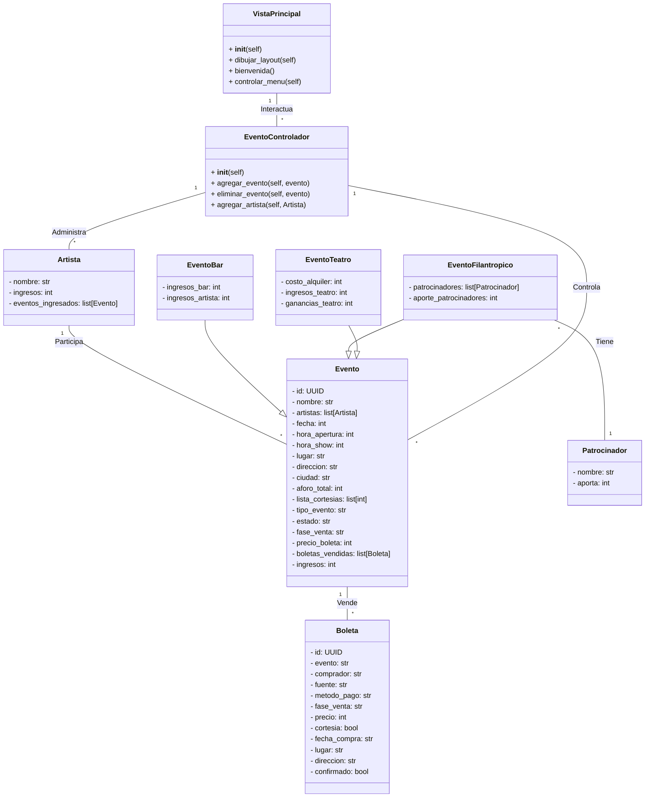

```mermaid
    classDiagram
        class Artista {
            - nombre: str
            - ingresos: int
            - eventos_ingresados: list[Evento]
        }

        class Evento {
            - id: UUID
            - nombre: str
            - artistas: list[Artista]
            - fecha: int
            - hora_apertura: int
            - hora_show: int
            - lugar: str
            - direccion: str
            - ciudad: str
            - aforo_total: int
            - lista_cortesias: list[int]
            - tipo_evento: str
            - estado: str
            - fase_venta: str
            - precio_boleta: int
            - boletas_vendidas: list[Boleta]
            - ingresos: int
        }
    
        class Boleta {
            - id: UUID
            - evento: str
            - comprador: str
            - fuente: str
            - metodo_pago: str
            - fase_venta: str
            - precio: int
            - cortesia: bool
            - fecha_compra: str
            - lugar: str
            - direccion: str
            - confirmado: bool
        }
    
        class EventoBar {
            - ingresos_bar: int
            - ingresos_artista: int
        }
    
        class EventoFilantropico {
            - patrocinadores: list[Patrocinador]
            - aporte_patrocinadores: int
        }
    
        class EventoTeatro {
            - costo_alquiler: int
            - ingresos_teatro: int
            - ganancias_teatro: int
        }
    
        class Patrocinador {
            - nombre: str
            - aporta: int
        }
    
        class EventoControlador {
            + __init__(self)
            + agregar_evento(self, evento)
            + eliminar_evento(self, evento)
            + agregar_artista(self, Artista)
        }
    
        class VistaPrincipal {
            + __init__(self)
            + dibujar_layout(self)
            + bienvenida()
            + controlar_menu(self)
        }
    
        Artista "1" -- "*" Evento : Participa
        Evento "1" -- "*" Boleta : Vende
        EventoBar --|> Evento
        EventoFilantropico --|> Evento
        EventoTeatro --|> Evento
        EventoFilantropico "*" -- "1" Patrocinador : Tiene
        EventoControlador "1" -- "*" Evento : Controla
        EventoControlador "1" -- "*" Artista : Administra
        VistaPrincipal "1" -- "*" EventoControlador : Interactua
```